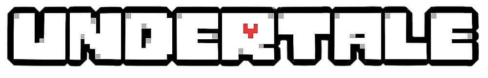

   

"Undertale" é um  RPG  indie com  uma  história envolvente sobre um personagem humano que cai em um mundo subterrâneo habitado por monstros. O jogo se destaca por suas mecânicas de combate únicas, onde você pode escolher entre lutar ou resolver conflitos de maneira pacífica.  Suas  escolhas  ao  longo  do  jogo  têm consequências significativas na narrativa e nos personagens, levando a  múltiplos finais  diferentes. Com gráficos pixelizados charmosos e uma trilha sonora marcante, "Undertale" é conhecido por sua originalidade
e capacidade de cativar os jogadores com sua história e personagens cativantes.

<iframe width="560" height="315" src="https://www.youtube.com/embed/xArt5AvMzd4?si=4VRMnNgBt4V-ZloJ" title="YouTube video player" frameborder="0" allow="accelerometer; autoplay; clipboard-write; encrypted-media; gyroscope; picture-in-picture; web-share" referrerpolicy="strict-origin-when-cross-origin" allowfullscreen></iframe>

---

## Contribuidores

<table>
  <tr>
    <td align="center"><a href="https://github.com/BiancaPatrocinio7"> <b>Bianca Castro - 221008801</b></a> </td>
    <td align="center"><a href="https://github.com/GabrielMS00"> <b>Diego Carlito - 221007690</b></a> </td>
        <td align="center"><a href="https://github.com/JohnnyLopess"> <b>Marcos Castilhos - 221008300</b></a> 
        <td align="center"><a href="https://github.com/JoseFilipi"> <b>Samara Letícia - 221008445</b></a> 
  </tr>
</table>

### Histórico de versões

    | Versão |     Data    |         Descrição                  |         Autor       |       Revisão      |
    | :----: | :---------: | ---------------------------------- | ------------------- | ------------------ |
    | `1.0`  | 08/04/2024  | Estruturação do README do projeto  |[Bianca Castro](https://github.com/BiancaPatrocinio7)| ------------------ |
